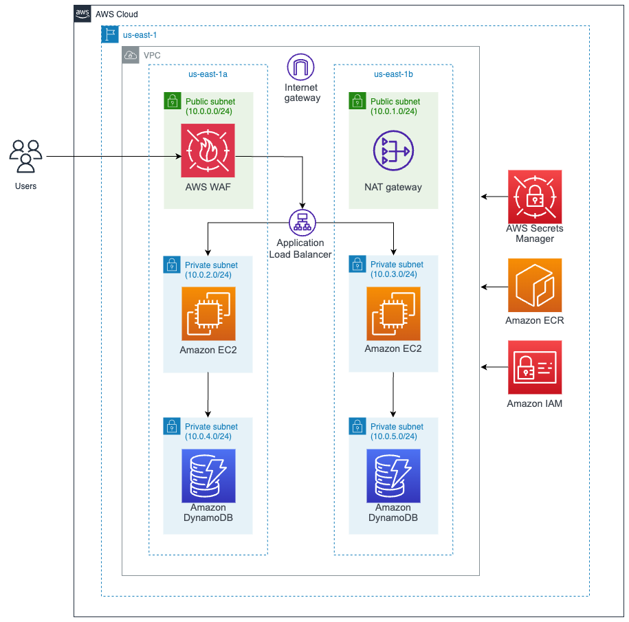

# AWS Architecture

## Infrastructure

* VPC
* Amazon EC2
* Amazon DynamoDB
* AWS WAF
* AWS Secrets Manager
* AWS ECR
* Amazon IAM

## Infrastructure Cost

Costo por mes durante 24 horas:

* VPC: 9,13 USD
* Amazon EC2: 248,20 USD  - 2 instances - instance type: c5.xlarge  vCPUs: 4 GiB Memory: 8 GiB
* AWS WAF: 15 USD - Number of Web ACLs utilized: 1 (ALB) Number of Rules added per Web ACL: 10
* AWS Secrets Manager: 0,40 USD - Number of secrets: 1 (DynamoDB) Average duration of each secret: 30 days API calls: 50
* AWS ECR: 0,10 USD - Amount of data stored: 1 GB
* Amazon IAM: 0 USD

**Total cost: 272,83 USD**

**AWS Pricing Calculator:** https://calculator.aws/#/addService

